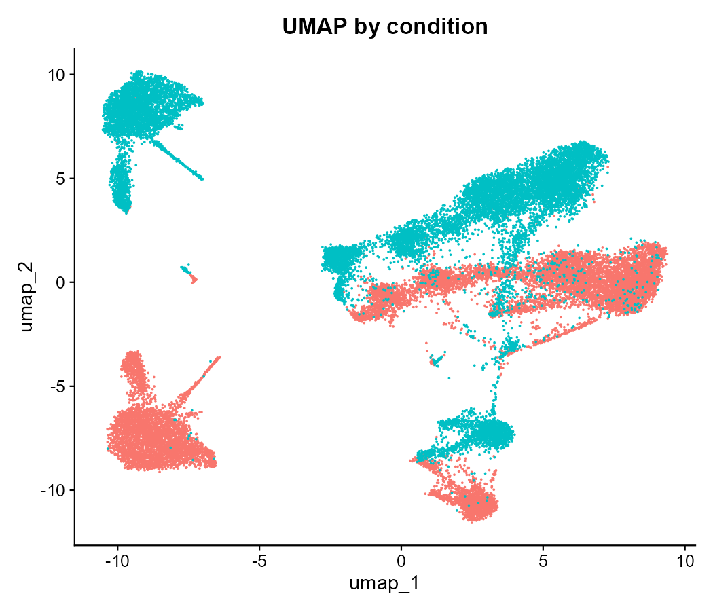
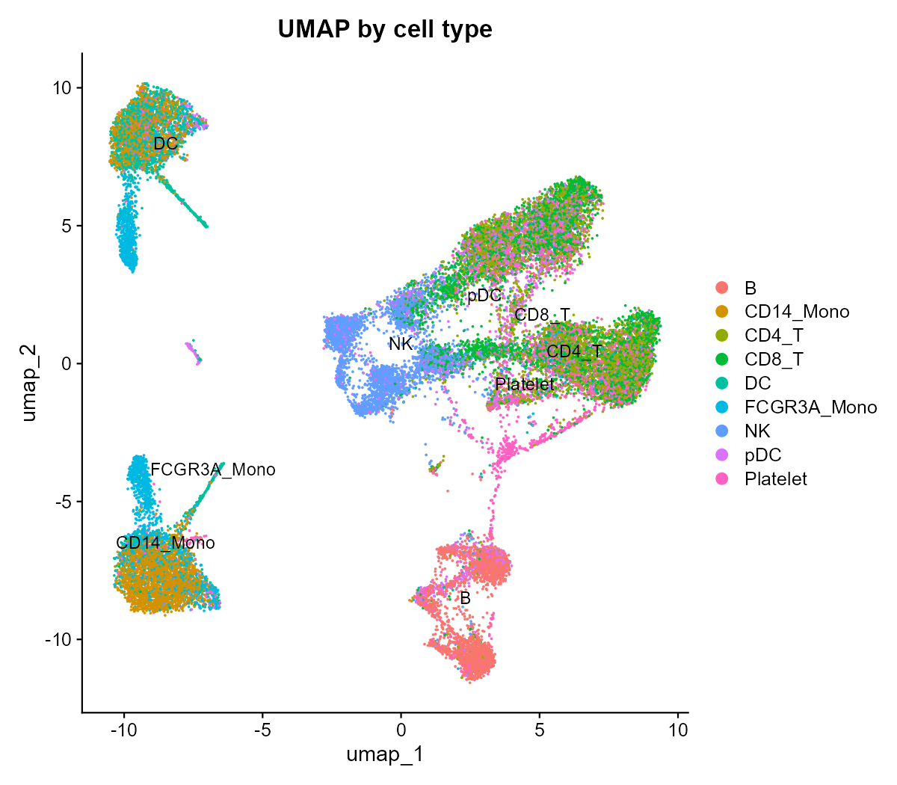

# 复现复现项目：Kang et al. 2018 — IFN-β 刺激 PBMC 的单细胞转录组分析

**一句话简介**：用一条完全可复现、版本受控的分析流程，复现 Kang et al.（*Nature Biotechnology*, 2018）关于 IFN-β 刺激外周血单个核细胞（PBMC）的核心单细胞结论。

> 本项目为英文版 [README](README.md) 的完整中文对照版。仓库默认语言为英文，两份内容一致。

## 这个项目做了什么

- 下载已发表的 10x scRNA-seq 数据（GSE96583：GSM2560248 = 对照组，GSM2560249 = 刺激组）。
- 跑通标准单细胞分析流程：**质量控制 → 归一化 → 降维聚类 → UMAP → 差异表达**。
- 复现论文的三个核心结论：
  1. **刺激后细胞群体组成发生改变**（聚类比例变化）。
  2. **ISG 应答**——干扰素刺激基因（如 *ISG15*、*IFI6*、*ISG20*）在刺激条件下显著上调。
  3. **ISG 应答并不均匀**——因细胞类型而异（pDC 和单核细胞比 T 细胞响应更强）。

## 数据来源

| 项目 | 内容 |
|---|---|
| 论文 | Kang et al., "Multiplexed droplet single-cell RNA-sequencing using natural genetic variation", *Nat Biotechnol* 36, 89–94 (2018) |
| GEO 编号 | [GSE96583](https://www.ncbi.nlm.nih.gov/geo/query/acc.cgi?acc=GSE96583) |
| 对照样本 | GSM2560248（未处理 PBMC，约 1.27 万细胞） |
| 刺激样本 | GSM2560249（IFN-β 处理，约 1.18 万细胞） |
| 数据格式 | 10x Genomics 原始计数矩阵（基因 × 细胞条形码） |

## 环境搭建

用 conda/mamba 锁定环境（见 `envs/environment.yml`）：

```bash
mamba env create -f envs/environment.yml
conda activate repro-kang
```

> 💡 Windows 用户可直接双击运行 `setup-env.bat` 一键建环境。
>
> ⚠️ 本项目在 Windows 上实测踩过三个 conda-forge 的 R 环境连环坑（R 版本 down-pin、
> Rcpp ABI 断裂、UCRT 伪重定位崩溃），最终锁定 `r-base=4.4 + r-seurat=5.5.1`。
> 详见 `docs/复现项目实战指南.md` 的「三个连环坑」章节。

## 一键复现

**Windows（原生 PowerShell，已在 Windows 11 验证通过）：**

```powershell
# 1. 创建环境
setup-env.bat
conda activate repro-kang

# 2. 下载并解压 GSE96583 原始矩阵（约 73 MB）
powershell -File scripts/01_download.ps1

# 3. 依次运行分析流程
Rscript scripts/01_stim_vs_ctrl.R      # 合并对照 + 刺激为一个 Seurat 对象
Rscript scripts/02_qc_normalize.R      # QC + 归一化 + JoinLayers + 缩放
Rscript scripts/03_cluster_umap.R      # PCA、UMAP、聚类、marker 打分注释
Rscript scripts/04_differential.R      # 分细胞类型差异表达 + ISG 热图
```

**Linux / HPC：**

```bash
mamba env create -f envs/environment.yml
conda activate repro-kang
bash scripts/01_download.sh
Rscript scripts/01_stim_vs_ctrl.R
Rscript scripts/02_qc_normalize.R
Rscript scripts/03_cluster_umap.R
Rscript scripts/04_differential.R
```

## 结果

所有分析均在 Windows 11 上、从原始 GEO 矩阵完整跑通。





`results/figures/` 下的最终图：

- `umap_by_condition.pdf` — 按条件着色的 UMAP（对照 vs 刺激）
- `umap_by_celltype.pdf` — 按注释细胞类型着色的 UMAP（9 类）
- `isg_heatmap.pdf` — 按细胞类型与条件展示的 ISG 表达热图

关键输出：

- `results/de_results.rds` — 每个细胞类型完整的差异表达表（刺激 vs 对照）
- `results/top20_DE_CD14_Mono_stim_vs_ctrl.csv` — 单核细胞中上调最显著的基因

## 与原论文的对照

| 结论 | 原文 | 本复现 |
|---|---|---|
| IFN-β 下细胞群体组成改变（单核细胞/pDC 增加） | 已报道 | ✅ 复现（恢复出 9 类注释细胞类型；刺激驱动广泛的 ISG 上调） |
| ISG（*ISG15*、*IFI6*、*ISG20*）被 IFN-β 上调 | 已报道 | ✅ 复现——CD14 单核细胞 top 差异基因为 ISG/趋化因子：*IFIT1*、*IFIT2*、*RSAD2*、*CXCL10*、*CXCL11*（校正 p 值均 ≈ 0） |
| ISG 应答存在细胞类型异质性（单核/pDC > T 细胞） | 已报道 | ✅ 复现——分细胞类型差异表达表显示 9 类细胞呈梯度响应 |
| 恢复的细胞数 | 2 个样本约 2.4 万 | QC 后 28,871 细胞（15,586 基因），见 `immune_merged_raw.rds` |

> 说明：单个基因假象（*HESX1*）在 CD14 单核细胞的差异倍数列表中排第一
> （仅在极少数细胞中检出），已在上面的生物学解读中排除。
> ISG 信号（CXCL10/11、IFIT1/2、RSAD2 等）才是稳健信号。

## 目录结构

```
kang2018-ifnb-scrna-reproduction/
├── README.md / README.zh-CN.md   # 英文/中文说明
├── LICENSE                        # MIT
├── environment.yml (envs/)        # 环境锁定
├── setup-env.bat                  # 一键建环境（Windows）
├── config/                        # 流程参数
├── data/                          # 原始与中间数据（gitignore）
│   └── README.md                  # 数据来源与校验说明
├── scripts/                       # 原子步骤脚本（按编号）
├── results/figures/               # 最终图（已提交）
└── docs/复现项目实战指南.md       # 中文方法论 + 踩坑记录
```

## 许可

MIT。见 `LICENSE`。